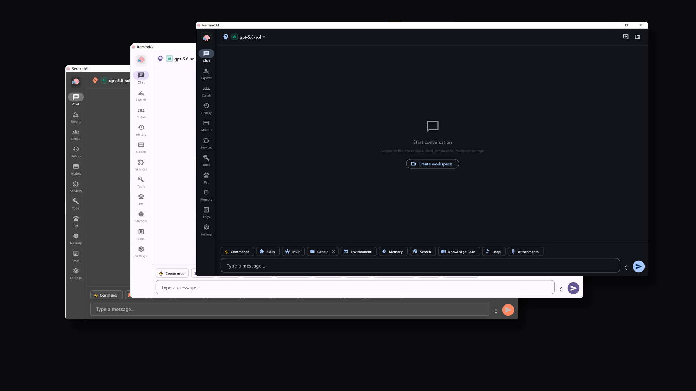
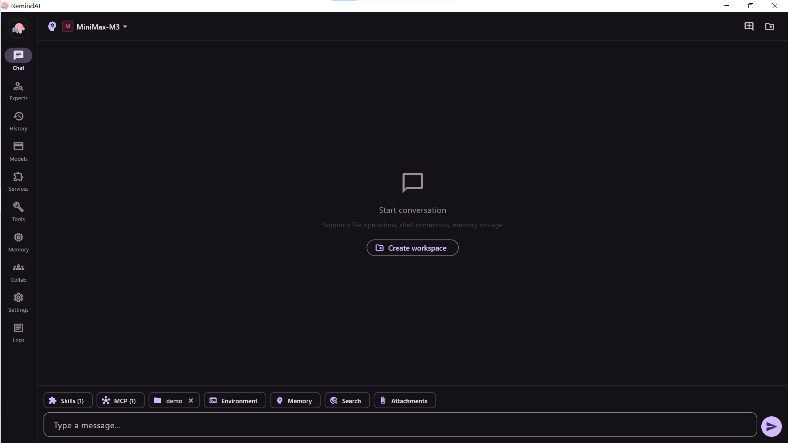
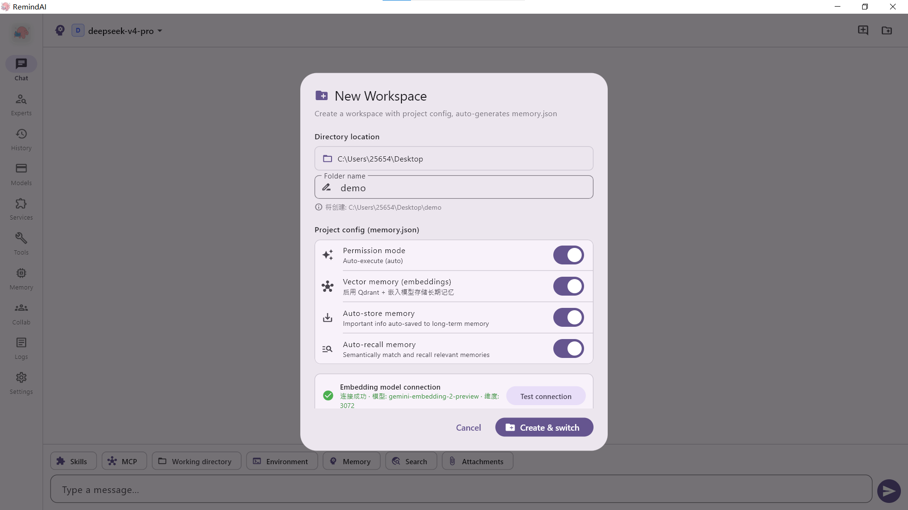
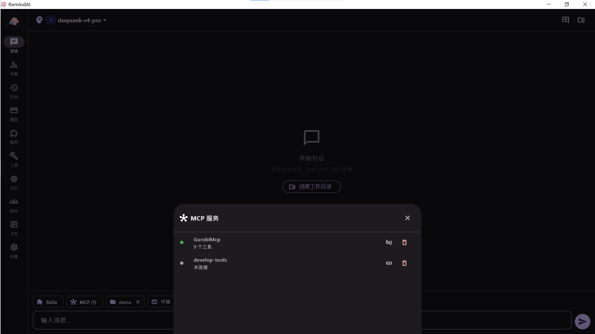
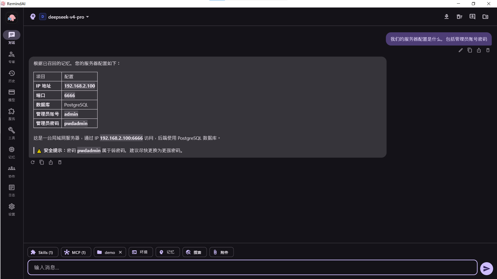
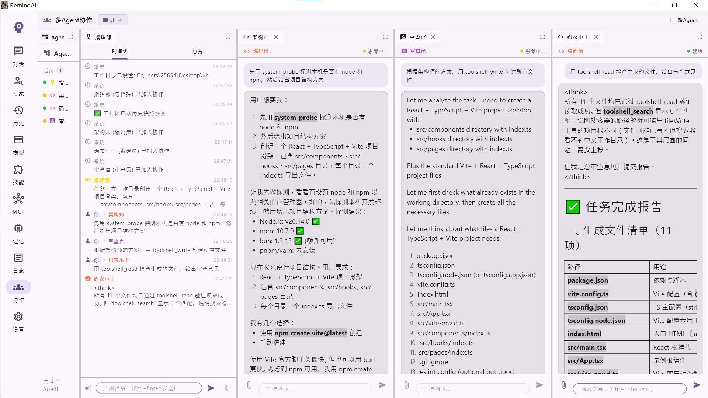
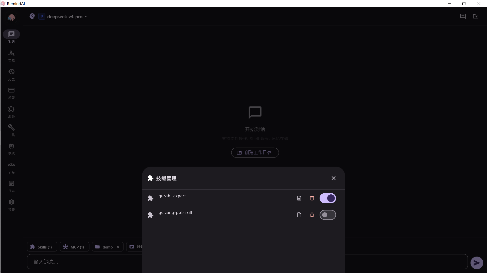

<div align="center">
  
  <h1>🧠 RemindAI</h1>
  <p><strong>v1.0.4 — 开源桌面 AI 助手，不再只是对话</strong></p>
  <p>
    <a href="./README_EN.md">🌐 English</a> |
    <a href="https://github.com/PythonnotJava/RemindAI/releases">📦 下载</a> |
    <a href="#-快速开始">🚀 快速开始</a>
  </p>
  <p>
    
    
    
       
    
    
    
    
  </p>
</div>

---

<p align="center">
  
</p>

---

## 🆕 V1.0.4 更新

| 更新项 | 说明 |
|--------|------|
| 🔄 长对话防卡顿优化 | 优化思考过程中途可能产生的卡顿问题 |
| 🔍 软失效过滤优化 | 避免过时记忆与新记忆同权重混合在检索结果里 |
| 🤝 多 Agent 并行编排 | 编排多 Agent 对大量文档进行并行理解的命令 |
| 🛠️ 可控 AgentLoop 模式 | 从思考、编写、测试到验证的循环流水线 |
| 📦 技能批量导入 | 技能现在可以批量导入 |
| 🎨 代码高亮优化 | 优化了代码高亮文本渲染 |
| 📊 Flowchart 总结 | 使用 [archify](https://github.com/tt-a1i/archify) 对对话进行流程图总结输出 |

---

## 💡 这是什么

RemindAI 是一个**开源桌面 AI 助手**，核心理念是为大模型提供一层完整的**工具外壳 (ToolShell)**，让 AI 不仅能聊天，还能直接操作文件、执行代码、调用外部工具、管理记忆、自主规划任务——成为真正能「上手」干活的生产力工具。

> 🎯 让 AI 走出对话框，真正「上手」你的工作。

### 🆚 与普通 AI 客户端的区别

| | 🔵 普通 AI 客户端 | 🟣 RemindAI |
|---|---|---|
| 📁 文件操作 | ❌ 不支持或需插件 | ✅ 内置沙盒文件系统 |
| 💻 代码执行 | ❌ 不支持 | ✅ 内置 Python/Shell/JS 执行器 |
| 🧠 记忆 | ❌ 无或仅上下文 | ✅ 向量语义记忆 + SQLite 持久化 + 软失效过滤 |
| 🔌 工具扩展 | ⚠️ 有限 | ✅ MCP 协议 + 四层技能系统 + Capability 插件 |
| 🤝 多 Agent | ⚠️ 多窗口并排 | ✅ 真协作：指挥部广播、权限隔离、自动路由 + 并行文档理解 |
| 🌐 对外服务 | ❌ 不支持 | ✅ 内置 HTTP API 服务器，三种端点对外暴露 |
| 🔄 AgentLoop | ❌ 无 | ✅ 可控循环流水线：思考→编写→测试→验证 |
| 📦 技能导入 | ⚠️ 单个导入 | ✅ ZIP 一键导入 + 批量导入 |
| 🐱 全局陪伴 | ❌ 无 | ✅ 像素宠物 + TTS 语音 + 商店经济 + 成就系统 |

---

## 🏗️ RemindAI 的 Skill 系统

RemindAI 的 Skill 系统采用**四层架构**，每一层都有独立的存储目录和生命周期，互不干扰：

| 层级 | 名称 | 存储位置 | 生命周期 | 说明 |
|------|------|----------|----------|------|
| **L1** | 默认元 Skill | `assets/default_skills/` | 全局，随应用发布 | ToolShell、Schedule、System 三个核心元技能，构成 AI 的基础操作能力：文件读写、命令执行、任务规划、环境探测 |
| **L2** | 用户全局 Skill | `Skills/` | 全局，用户手动开关 | 用户通过 ZIP 导入或 `/skill-cti` 命令创建，可跨项目复用。格式为 `SKILL.md` + `tools.json` |
| **L3** | 工作目录临时 Skill | `.toolshell/skills/` | 跟随工作目录，恒定激活 | AI 在指导用户时按需创建，固化当前项目的临时流程，切目录即消失，**绝不污染全局技能库** |
| **L4** | AI 自生成 Skill 🧪 | （规划中） | 全局，出于安全性暂未实现 | AI 根据长期对话记忆自动总结用户偏好（例如你常请教运筹优化问题，AI 自动沉淀为一个运筹优化专属技能），并自行调用 |

### 设计理念

- **L1 元技能**：相当于 AI 的「操作系统内核」——文件读写、命令执行、环境探测、任务管理，是 ToolShell 的底层基础
- **L2 全局技能**：用户的「工具箱」——可复用的专业能力，如特定领域代码生成、文档模板、工作流自动化
- **L3 临时技能**：AI 的「便签纸」——在当前项目中临时固化一段流程，用完即弃，不留痕迹。例如 `memory.json` 中的 ToolShell/Schedule/System 元技能定义，就是通过 L3 机制注入的
- **L4 自生成技能**（规划中）：AI 的「长期学习」——从多轮对话中提炼用户的领域偏好和工作模式，自动形成个性化技能。**考虑到自动生成代码执行的安全风险，该层暂未实现**

### 技能工作流

| 命令 | 用途 | 去向 |
|------|------|------|
| 直接要求创建技能 | 在当前工作目录创建项目级技能 | L3 `.toolshell/skills/`（默认） |
| `/skill-temp` | 显式创建项目级临时技能 | L3 `.toolshell/skills/` |
| `/skill-cti` | 创建 → 自测 → 安装为全局技能 | 先在 `.toolshell/_staging/` 搭建自测，通过后装到 L2 `Skills/` |

> 💡 若 RemindAI 的技能系统对您的项目、论文等研究起到启发作用，请协助我改进、链接该项目，这也对我毕业、工作有很大帮助 🙇‍

---

## 📊 功能完成度

| 模块 | 状态 | 说明 |
|---|---|---|
| AI 对话核心 (LLM + tool calling) | ✅ | AgentLoop 流式循环 + 事件驱动 UI |
| 可控 AgentLoop 流水线 | ✅ | 思考 → 编写 → 测试 → 验证 循环模式 |
| 三端 LLM 适配 (OpenAI/Anthropic/Gemini) | ✅ | 各自独立客户端，流式+tool_call+多模态 |
| ToolShell 元技能 | ✅ | 读/写/删/搜索/exec/python/js + rg/fd/rtk |
| Schedule 元技能 | ✅ | 7 工具 CRUD + 审查 + 归档 |
| System 元技能 | ✅ | 环境探测 + 环境变量脱敏 |
| MCP 多传输 | ✅ | stdio / SSE / Streamable HTTP |
| 向量记忆系统 | ✅ | Qdrant + SQLite 双写 + 自动容灾 + 软失效过滤 |
| 可插拔 Capability | ✅ | 搜索能力已落地，框架可扩展 |
| 四层技能系统 | ✅ | L1 默认元技能 + L2 用户全局 + L3 临时技能 + L4 规划中，支持批量导入 |
| 模型 Card 管理 | ✅ | 增删改 + Logo + 拖拽排序 |
| 多 Agent 协作 | ✅ | 框架搭建完成 + 并行文档理解编排 + 可控 AgentLoop 流水线 |
| 领域专家系统 | ✅ | 预设/自定义角色 + 绑定技能 |
| 对话导出 | ✅ | MD / PDF / Word / HTML |
| 桌面体验 | ✅ | 托盘 / 通知 / 闪屏 / 主题动画 |
| 全局宠物 Agent | ✅ | 像素猫 + TTS 语音 + 商店经济 + 成就系统 |
| 对外 API 服务 | ✅ | 内置 HTTP 服务器，三种端点：OpenAI 聚合 / Claude Agent / Claude 代理 |
| 在线访问 Agent | ✅ | 通过浏览器远程访问 RemindAI Agent |
| 上下文压缩 | ✅ | RTK Token 压缩 60-90% + 上下文管理优化 |
| Flowchart 总结 | ✅ | 使用 [archify](https://github.com/tt-a1i/archify) 对对话进行流程图总结 |

---

## 🌟 更多特性

| 特性 | 说明 |
|---|---|
| 🐚 ToolShell | 文件沙盒 + Python/Shell/JS 执行 + rg/fd/rtk + RTK 压缩 60-90% token |
| 🌐 对外 API 服务 | 内置 HTTP 服务器，三种端点：OpenAI 聚合、Claude Agent（运行 RemindAI 自身的 AgentLoop）、Claude 代理（纯透传） |
| 🔌 MCP 协议 | stdio/SSE/Streamable HTTP 三传输 + 工具自动发现 + 拖拽管理 |
| 🧠 向量记忆 | Qdrant 语义搜索 + SQLite 持久备份 + 自动运维 + 软失效过滤 + 记忆重建 |
| 🤝 多 Agent | 指挥部/工作者/审查员角色 + 权限隔离 + 自动路由 + 并行文档理解编排 |
| 🔄 可控 AgentLoop | 思考 → 编写 → 测试 → 验证 的循环流水线模式，长对话防卡顿优化 |
| 🎨 多模型 | OpenAI/Anthropic/Gemini 原生适配 + 流式推理链 + 多模态 |
| 🧩 Capability | 可插拔能力架构，Custom → MCP → ToolShell 三级路由 |
| 📦 技能系统 | 四层架构 (L1 元技能 / L2 全局 / L3 临时 / L4 自生成规划中)，SKILL.md + tools.json 格式，ZIP 一键导入 + 批量导入，支持命令创建 |
| 🔍 Web 搜索 | Tavily / Brave / 百度智能搜索，会话级开关 |
| 📋 Schedule | SCHEDULE.md 驱动，P0/P1/P2 优先级，AI 主动回顾 |
| 👤 领域专家 | 预设/自定义角色 + 独立 system prompt |
| 🖼️ 内置工具 | Gemini 文生图 / 公式 OCR / PaddleOCR / 流程图 / 富文本 |
| 📊 Flowchart | 使用 [archify](https://github.com/tt-a1i/archify) 对对话进行流程图总结输出 |
| 📤 导出 | Markdown / PDF / Word / HTML |
| 🌍 国际化 | 完整中英双语 |
| 🎨 主题 | Material 3 亮/暗 + 涟漪切换动画 |
| 🐱 全局宠物 Agent | 像素猫陪伴 + 右键智能问答 + 火山TTS语音 + 商店/背包/投喂 + 成就系统 |
| 🗜️ 上下文压缩 | RTK 命令输出压缩 + 对话上下文智能裁剪 |
| 🌐 在线访问 | 浏览器远程访问 Agent，在线会话管理 |

### 📦 内置 CLI 工具

应用自带以下可执行文件，无需用户额外安装：

| 工具 | 说明 | 来源 |
|---|---|---|
| `rg` | [ripgrep](https://github.com/BurntSushi/ripgrep) — 极速正则搜索 | BurntSushi/ripgrep |
| `fd` | [fd](https://github.com/sharkdp/fd) — 现代化文件查找 | sharkdp/fd |
| `rtk` | [RTK](https://github.com/rtk-ai/rtk) — Token 压缩器，减少 60-90% 命令输出 token | nicobailey/rtk |

---

## 🚀 快速开始

### 📥 下载

前往 [Releases](https://github.com/PythonnotJava/RemindAI/releases) 下载预编译包：

| 平台 | 状态 | 说明 |
|---|---|---|
| 💻 Windows | ✅ 正式支持 | 提供安装包 |
| 🐧 Linux | 🔧 自行编译 | 源码构建即可使用 |
| 🍎 macOS | 🔧 自行编译 | 源码构建即可使用 |

### 🔨 从源码构建

```bash
# 环境要求: Flutter SDK >= 3.12.1
git clone https://github.com/PythonnotJava/RemindAI.git
cd RemindAI

# Windows
flutter build windows --release --tree-shake-icons --split-debug-info=./debug-info

# Linux 
flutter build linux --release --tree-shake-icons --split-debug-info=./debug-info
# macOS
flutter create --platforms=macos
flutter build macos --release --tree-shake-icons --split-debug-info=./debug-info
```

---

## 🖼️ 截图

<details>
<summary>📸 点击展开</summary>

| 功能 | 截图 |
|---|---|
| 🏠 主界面 |  |
| 📁 工作目录 |  |
| 🔌 MCP 服务 |  |
| 🧠 记忆系统 |  |
| 🤝 多 Agent |  |
| 📦 技能系统 |  |

</details>

---

## 🙏 致谢 

感谢 **Yu** 为 RemindAI 设计了精巧灵动的 Logo，为产品注入了鲜活的生命力。

---

## 优化参考
- [https://arxiv.org/pdf/2606.24775](https://arxiv.org/pdf/2606.24775)，感谢该文章精确指出了记忆类架构的已知薄弱环节——缺乏版本管理导致检索到过时事实

## 优化思考
- 是否可以设计一种工具范式：大致这样，工具名字、工具的作用简介、工具的版本、工具的文档网站（以防模型不熟悉某工具的命令方便查阅），相关时Agent可以自动注入

---

## ☕ 赞助

如果 RemindAI 对你有帮助，欢迎选择性赞助支持开发 ~

<p align="center">
  
  &nbsp;&nbsp;&nbsp;&nbsp;&nbsp;&nbsp;
  
</p>
<p align="center">
  <sub>💚 微信 &nbsp;&nbsp;&nbsp;&nbsp;&nbsp;&nbsp;&nbsp;&nbsp;&nbsp;&nbsp;&nbsp;&nbsp;&nbsp;&nbsp;&nbsp;&nbsp;&nbsp;&nbsp;&nbsp;&nbsp;&nbsp;&nbsp;&nbsp;&nbsp;&nbsp;&nbsp;&nbsp;&nbsp;&nbsp;&nbsp;&nbsp;&nbsp; 🔵 支付宝</sub>
</p>

---


## 📄 许可证

[MIT License](./LICENSE) — Copyright (c) 2026 PythonnotJava

<div align="center">
  <sub>用 Flutter 和热情构建 ❤️</sub>
</div>
